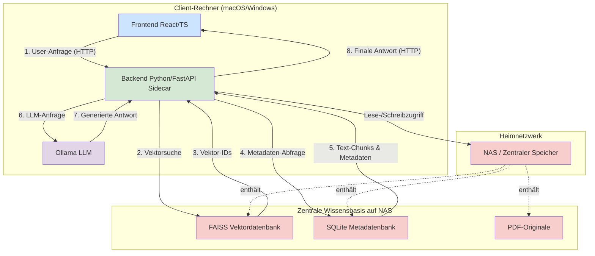

# 🏛️ Systemarchitektur: dango-dingo

Dieses Dokument beschreibt die Architektur und den Datenfluss des `dango-dingo` Systems. Die Architektur ist als **"Local First" mit zentraler Datenhaltung** konzipiert.

## 1. Komponenten-Diagramm

Das System besteht aus den folgenden Hauptkomponenten, die lokal auf dem Client-Rechner ausgeführt werden, aber auf eine zentrale Datenquelle zugreifen.

## 2. Datenfluss-Beschreibung

### Typischer Query-Ablauf

1. **User-Anfrage:** Der Nutzer stellt eine Frage über das React-Frontend
2. **Vektorsuche:** Das Backend führt eine semantische Suche in FAISS durch
3. **Metadaten-Abruf:** Zu den gefundenen Vektor-IDs werden die zugehörigen Text-Chunks aus SQLite geladen
4. **LLM-Generierung:** Der lokale Ollama-Server generiert eine Antwort basierend auf dem Kontext
5. **Antwort-Rückgabe:** Die finale Antwort wird über das Backend an das Frontend zurückgegeben

### Daten-Synchronisation

- Alle Daten werden zentral auf dem NAS gespeichert
- Clients greifen direkt über Netzwerk-Shares auf die Datenbank-Dateien zu
- SQLite und FAISS sind dateibasiert und unterstützen gleichzeitigen Lesezugriff
- Schreibvorgänge werden durch Application-Level-Locking koordiniert
